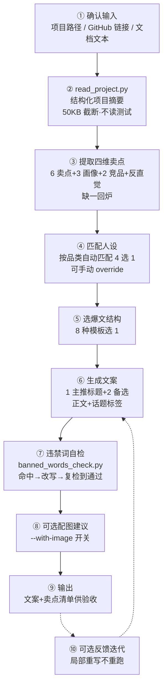

<div align="center">

# 📕 Tech-Finds-Deep-Dive

**深度读懂技术项目 / 开源项目 / skill，产出可直接发布、不千篇一律的小红书种草文案**

*Deep-dive into a tech project, publish-ready Xiaohongshu post* / Python 脚本 + Markdown 知识包

[](https://www.python.org/)
[](./LICENSE)
[]()
[]()

[快速开始](#-快速开始) · [核心亮点](#-核心亮点) · [工作流程](#-工作流程) · [项目结构](#-项目结构)

</div>

---

## 📌 这是什么

市面上"技术项目写小红书"的 skill 大多敷衍：**只给一篇文案、不深挖产品、不分人设、不管违禁词**——读完项目只抓功能列表，套一个固定"种草博主"口吻，产出的文案千篇一律，发出去还容易踩广告法违禁词被判违规。

Tech-Finds-Deep-Dive 把"读懂"变成有硬标准的流程：**四维卖点缺一不可**（≥6 差异化卖点 + ≥3 用户画像痛点场景 + ≥2 竞品差异 + ≥1 反直觉卖点），**人设按品类自动匹配**（学生党 / 转码人 / 技术博主 / 求职者四选一），**违禁词自检 + 改写 + 复检闭环**——产出可直接复制发布、且同一项目多次产出有差异化的种草文案。

> 它不是"文案生成器"，是"读懂 + 人设 + 合规"三合一的种草流水线。读懂不达标（四维缺任一维）会强制回炉重提，违禁词不通过会强制改写复检到通过为止——**敷衍在流程里走不通**。

## ✨ 核心亮点

每条亮点都落到具体文件 / 机制，不是空话：

- 🎯 **四维卖点硬约束（缺一不可）** — `references/selling-points-framework.md` 定义提取框架：≥6 个差异化卖点（从架构 / 技术栈 / 性能 / 痛点 / 代码质量 / 生态 6 类角度各挖至少 1 个，禁"性能好"空话）、≥3 种用户画像痛点场景（画像+场景+行为+痛点+项目怎么救五元组）、≥2 个最接近竞品并说清差异、≥1 个反直觉卖点。缺任一维 → 回到步骤 3 重提，不能跳过
- 🧑🤝🧑 **4 人设按品类自动匹配 + 词汇表豁免** — `references/persona-*.md` 四个完整人设（口吻 / 痛点 / 词汇表 / 常用 hook）。按产品品类自动匹配（学生项目→学生党、工具→转码人、框架/开源→技术博主、简历项目→求职者），用户可手动 override。人设词汇表豁免机制：命中违禁词若属当前人设正常表达（如学生党的"绝了/宝藏/真的香"），不强制改；换人设则需重检
- 🔍 **8 种爆文结构模板内置选 1** — `references/post-templates.md` 内置成长记 / 成果展示 / 对比测评 / 避坑指南 / 开源分享 / 简历项目 / 学生党必备 / 源码精读 8 种结构，每种含适用场景、适合人设、结构骨架、标题公式、话题标签、字数建议。不外搜小红书，结构稳定可复现
- 🛡️ **违禁词自检 + 改写 + 复检闭环** — `scripts/banned_words_check.py` + `assets/banned-words.json`（5 类违禁词：绝对化 / 技术敏感 / 医疗功效 / 夸张限流 / 虚假背书，含级别 illegal / sensitive / limit 与改写建议）。命中 → LLM 结合上下文改写（非机械替换）→ **必须复检一遍**，仍命中继续改到通过为止
- 🎯 **单字词防误报** — `banned_words_check.py` 内置两条防误报规则：单字违禁词后接中性字（后/初/近/终/先）按"最后/最近"等中性词跳过；"第一"后接量词（个/次/天/年…）按序数事实陈述跳过。解决"正常文案被违禁词扫描误伤强改"的问题
- 📦 **结构化项目摘要（context 友好）** — `scripts/read_project.py` 只读核心文件（README / 技术栈 / 主入口 / 架构文档 / 关键模块一层结构），**不读测试用例、单文件 50KB 截断**，避免读整个项目导致 context 爆炸。脚本不可用（Python 缺失 / 路径不可解析）时 LLM 用 Read 工具按相同范围 fallback，不中断流程
- 🪝 **SKILL.md 作为 README fallback** — `read_project.py` 的 README 候选列表把 `SKILL.md` 放最后——推广对象本身是 skill 时通常无 README，核心文档是 SKILL.md，兜底不空读
- 🔁 **局部重写不重跑全流程** — 用户对初稿提意见（换人设 / 换模板 / 突出某卖点 / 调语气）→ 只重写受影响部分，不重跑步骤 2-5；仅换项目 / 换输入时才从头跑。慢且丢失已确认部分的问题被流程化规避

## 🏗️ 工作流程

十步流水线，读懂 → 人设 → 结构 → 文案 → 合规：



| 步骤 | 关键约束 | 落点 |
|---|---|---|
| ② 读项目 | 只读核心文件，不读测试，50KB 截断；脚本不可用则 Read 工具 fallback | `scripts/read_project.py` |
| ③ 四维卖点 | 缺一不可，缺维回炉；禁"性能好"空话，卖点要可换竞品验证 | `references/selling-points-framework.md` |
| ④ 人设匹配 | 品类自动匹配，不能固定单一博主人设；可 override | `references/persona-*.md` |
| ⑤ 结构选择 | 8 选 1，不外搜 | `references/post-templates.md` |
| ⑥ 生成文案 | 人设口吻 + 小红书风格，格式参照范文 | `references/example-posts.md` |
| ⑦ 违禁词 | 命中必改写，改写后必复检到通过；人设词汇表豁免 | `scripts/banned_words_check.py` |
| ⑩ 迭代 | 局部重写，不重跑 2-5 步 | SKILL.md Workflow 步骤 10 |

## 🚀 快速开始

0️⃣ **环境要求**

| 组件 | 版本 | 说明 |
|---|---|---|
| Python | 3.8+ | 仅标准库（argparse / json / pathlib），无第三方依赖 |
| 支持的项目语言 | 14 种 | node / python / go / rust / java / php / ruby / elixir / flutter / swift / cpp / make |

1️⃣ **一句话安装**

打开你正在用的 agent，直接告诉它：

```
帮我安装这个 skill：https://github.com/WeatherCore/tech-finds-deep-dive
```

2️⃣ **触发 skill**

对 LLM 说："用 tech-finds-deep-dive 把这个技术项目深度读懂，产出可发的小红书种草文案。" 三种输入任选：

- **项目路径**（默认，优先）：本地目录路径
- **GitHub 链接**：用 WebFetch 抓 README，项目结构信息需你补充
- **项目文档文本**：直接贴文本，跳过读项目步骤

3️⃣ **手动跑脚本（可选，验证环境）**

```bash
# 读项目摘要（markdown / json 两种输出）
python tech-finds-deep-dive/scripts/read_project.py <项目路径>
python tech-finds-deep-dive/scripts/read_project.py <项目路径> --output json

# 违禁词自检（直接传文案字符串）
python tech-finds-deep-dive/scripts/banned_words_check.py "这个项目最强，全网第一，闭眼入"

# 违禁词自检（从文件读文案）
python tech-finds-deep-dive/scripts/banned_words_check.py --file draft.md
```

4️⃣ **验收产出**

skill 输出最终文案 + 四维卖点清单。验收"读懂"是否达标：6 卖点 + 3 画像 + 2 竞品 + 反直觉卖点是否全有。违禁词是否复检通过（可自己再跑一遍 `banned_words_check.py` 确认）。

<details>
<summary><b>🔍 违禁词清单结构（点击展开）</b></summary>

`assets/banned-words.json` 分 5 类，每类带级别（illegal 必删 / sensitive 建议改 / limit 谨慎用）与改写建议：

| 类别 | 级别 | 示例 |
|---|---|---|
| 绝对化用语（广告法违禁） | illegal | 最 / 第一 / 顶级 / 全网 / 100% / 包过 |
| 技术敏感词 | sensitive | 破解 / 逆向 / 爬虫 / 黑客 / 翻墙 / 刷量 |
| 医疗功效词（误触） | sensitive | 疗效 / 治愈 / 根治（如"治愈了我的编程焦虑"） |
| 夸张限流词 | limit | 惊呆 / 绝了 / yyds / 必入 / 真的香 / 宝藏 |
| 虚假背书词 | illegal | 官方认证 / 央视推荐 / 国家专利 |

清单含 `replacements` 改写建议表（如"最"→"很/挺/相当"、"破解"→"理解/拆解/读懂"）与 `persona_exemptions` 人设豁免表（student 豁免"绝了/宝藏/真的香"）。数据与逻辑分离，词表可独立更新（建议每月 review 一次跟进小红书算法）。

</details>

## 📁 项目结构

```
Tech-Finds-Deep-Dive/
├── README.md                          # 本文件（项目门面）
├── LICENSE                            # MIT
├── Description.md                     # 项目名片（中英双版，GitHub About 用）
└── tech-finds-deep-dive/              # skill 本体
    ├── SKILL.md                       # skill 定义：Goal / Workflow / Decision Tree / Constraints / Validation
    ├── agents/
    │   └── openai.yaml                # skill 接口元数据（显示名 / 短描述 / 默认 prompt / 参数定义）
    ├── scripts/
    │   ├── read_project.py            # 读项目核心文件，产出结构化摘要（50KB 截断·不读测试·14 语言栈识别）
    │   ├── banned_words_check.py      # 违禁词自检：扫描+命中报告+改写建议（单字词防误报）
    │   └── tests/                     # 单元测试（read_project / banned_words_check 真实路径覆盖）
    │       ├── test_read_project.py
    │       └── test_banned_words_check.py
    ├── assets/
    │   └── banned-words.json          # 违禁词清单（5 类·级别·改写建议·人设豁免表，数据与逻辑分离）
    └── references/
        ├── execution-prompt.md          # LLM 执行用轻量指令（workflow + decision tree + constraints）
        ├── output-template.md         # 最终输出格式模板（文案 + 四维卖点清单 + 元信息）
        ├── selling-points-framework.md   # 四维卖点提取框架（6 卖点+3 画像+2 竞品+反直觉，操作指南）
        ├── post-templates.md             # 8 种爆文结构模板（场景/人设/骨架/标题公式/标签/字数）
        ├── persona-student.md            # 学生党人设（口吻/痛点/词汇表/hook）
        ├── persona-coder.md              # 转码/转行人设
        ├── persona-blogger.md            # 技术博主/测评博主人设
        ├── persona-jobseeker.md          # 求职者人设（简历项目包装视角）
        └── example-posts.md              # 2 篇完整范文（开源分享×技术博主、学生党必备×学生党，few-shot）
```

逐文件深度导读见 [ZHIDAO.md](ZHIDAO.md)（如需要可另行生成）。

## 🚧 Roadmap

- [x] 四维卖点提取框架（缺一不可硬约束）
- [x] 4 人设 + 品类自动匹配 + 词汇表豁免
- [x] 8 种爆文结构模板
- [x] 违禁词自检 + 改写 + 复检闭环（5 类词·3 级别·防误报）
- [x] 结构化项目摘要脚本（14 语言栈·50KB 截断）
- [x] 2 篇完整范文（few-shot 参照）
- [x] 脚本测试用例（read_project / banned_words_check 核心路径覆盖）
- [x] 执行 prompt 拆分 + 输出模板标准化
- [ ] 更多平台适配（B 站 / 掘金 / 知乎种草文案风格）
- [ ] 违禁词清单自动更新（跟进小红书算法变化）
- [ ] 配图建议模板库（`--with-image` 扩展）

---

<div align="center">

## 🤝 参与贡献

**参与贡献**：Fork → 新建分支 → 提交 PR

**License**：[MIT](./LICENSE)

如果这个 skill 帮你写出了能发的种草文案，欢迎 ⭐ Star 支持

</div>
